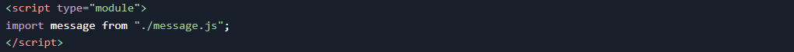
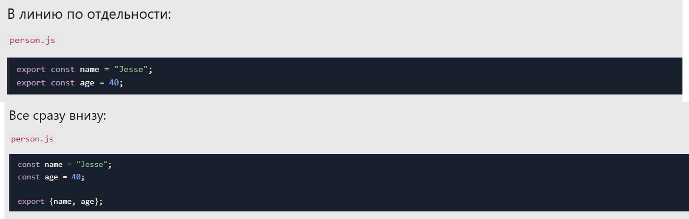
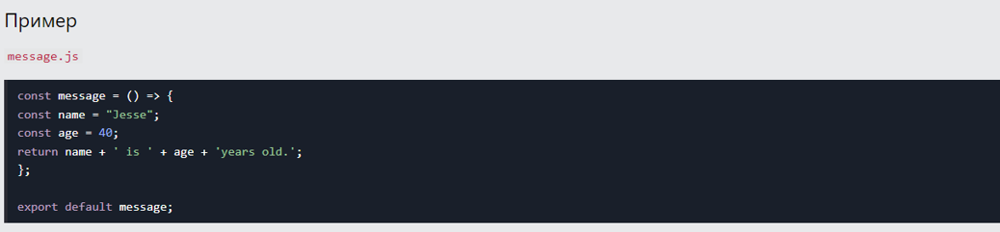
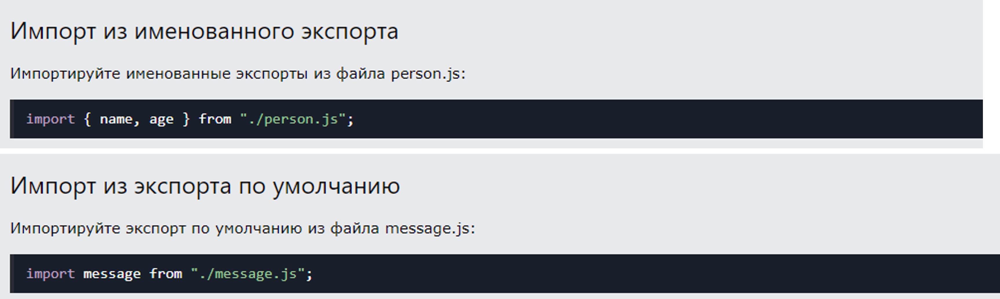

# Модули JavaScript
## Модули JavaScript позволяют разбивать код на отдельные файлы.
## Это упрощает поддержку кодовой базы.
## Модули импортируются из внешних файлов с importинструкцией.
## Модули также полагаются type="module"
## Пример

## Экспорт
## Модули с функциями или переменными можно хранить в любом внешнем файле.
## Существует два типа экспорта: именованный экспорт и экспорт по умолчанию .
## Именованные экспорты
## Давайте создадим файл с именем person.jsи заполним его вещами, которые мы хотим экспортировать.
### Вы можете создать именованный экспорт двумя способами. В линию по отдельности, или все сразу внизу.

## Экспорт по умолчанию
## Давайте создадим еще один файл с именем message.jsи используем его для демонстрации экспорта по умолчанию.
## В файле может быть только один экспорт по умолчанию.

## Импортировать
## Вы можете импортировать модули в файл двумя способами, в зависимости от того, называются ли они экспортами или экспортами по умолчанию.
## Именованные экспорты строятся с использованием фигурных скобок. Экспорт по умолчанию — нет.

